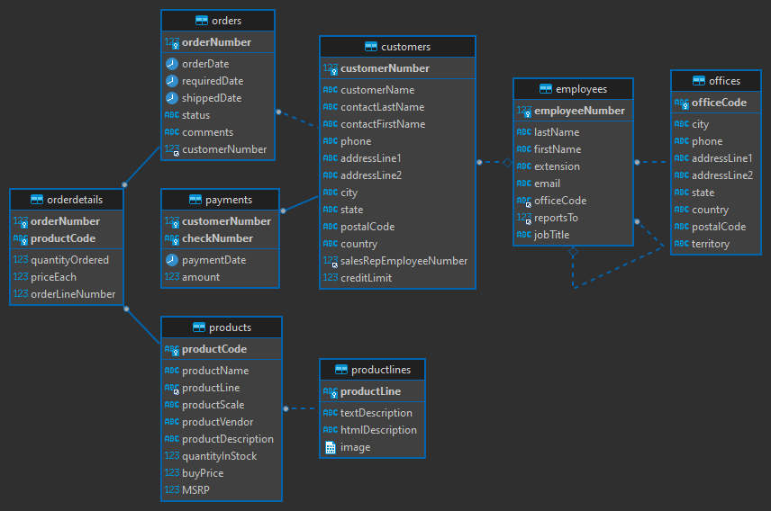

# A Simple DBT Project

## ER Diagram

## Questions

### Which product has the maximum profit margin ?
* Using `products` we can calculate column `maxProfitMargin` as `MSRP - buyPrice`.
  * We use `product_profit_margin.sql` to do this task.

### Most profitable customer ?
* Table `orderdetails` contains columns `orderNumber`, `productCode` and `quantityOrdered`.
  * Using column `productCode` and table `products` we can get the buy price of products.
  * Using `buyPrice`, `priceEach` and `quantityOrdered` we get `profitMargin` for every `orderNumber`.
    * We do this in `order_profit_margin.sql`
  * Using table `orders` we get `customerNumber` for every `orderNumber`.
  * We can finally calculate `profitMargin` for each `customerNumber`.
    * We do this in `customer_max_profit.sql`
  
### Most profitable order ?
* Using `order_profit_margin.sql` grouping on `orderNumber`.

### What are the average delays in shipping products ?
* Using `orders` we can get the shipping delay.
* Using `orders` and `orderdetails` we get delay for `productCode`.
* Using `products` and the previous result we get our final table.
* We do this with `product_shipping_delay.sql`.

### Most profitable sales rep ?
* Using `customer_max_profit` and `customers` we get `salesRepEmployeeNumber`.
* Then we can use agg

### Most profitable sales office ?

## Resources
* [Start here](https://www.startdataengineering.com/post/dbt-data-build-tool-tutorial/#1-introduction)
* [Config for MySQL](https://github.com/dbeatty10/dbt-mysql#supported-features)
* [Data Source](https://www.mysqltutorial.org/mysql-sample-database.aspx)